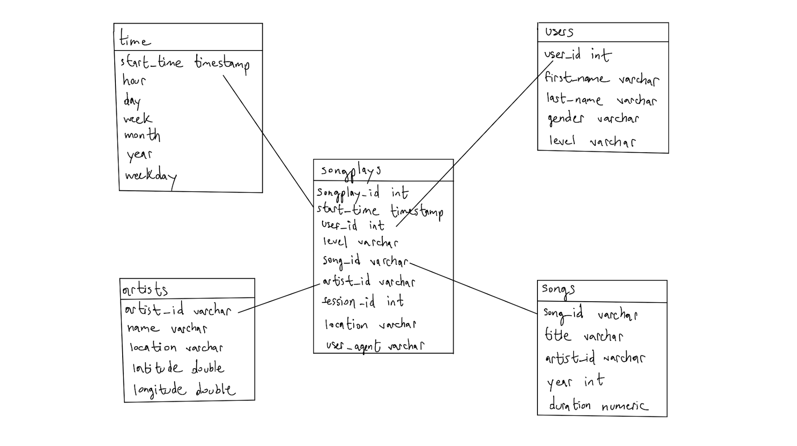
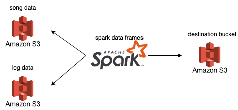

# Project Purpose:
A music streaming startup, Sparkify, has grown their user base and song database even more and want to move their data warehouse to a data lake. Their data resides in S3, in a directory of JSON logs on user activity on the app, as well as a directory with JSON metadata on the songs in their app.

As their data engineer, you are tasked with building an ETL pipeline that extracts their data from S3, processes them using Spark, and loads the data back into S3 as a set of dimensional tables. This will allow their analytics team to continue finding insights in what songs their users are listening to.

You'll be able to test your database and ETL pipeline by running queries given to you by the analytics team from Sparkify and compare your results with their expected results.

source: Udacity Data Lake Project Introduction

# Technologies:
- Python
- Apache Spark
- Amazon S3

# Schema Design:
The schema design being used is the STAR schema with 1 fact table: songplays and 4 dimension tables: artists, songs, users, and time.

# ETL Pipeline:
The python script etl.py extracts data from JSON meta data on songs and JSON logs on user events. The script then processes this data into dataframes using pyspark which represent fact and dimension tables, and finally writes the tables to parquet files which are then loaded to an s3 bucket.

